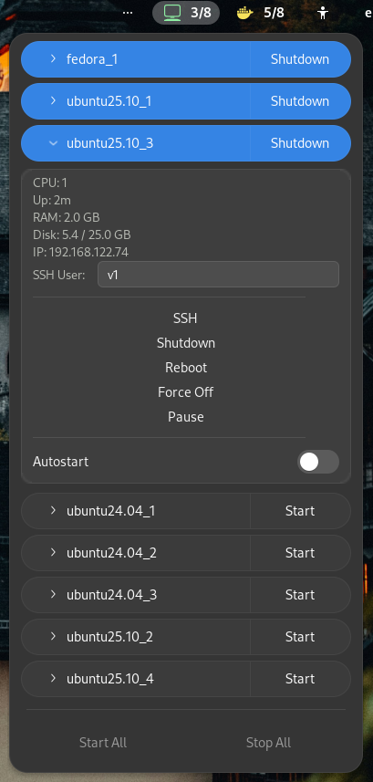

# GNOME VM Manager Extension

Manage QEMU/KVM virtual machines from the GNOME panel. A simple, native design that fits right in with the GNOME Shell.

## Features
*   **Overview:** Quick overview of all virtual machines and their current states.
*   **VM Control:** Start, shutdown, reboot, and force off (destroy) VMs.
*   **Session Management:** Suspend and resume support for active sessions.
*   **Autostart:** Toggle 'Autostart' directly from the menu.
*   **Detailed Info:** View VM details including CPU, RAM, and Disk allocation.
*   **Live Performance:** Real-time performance monitoring (CPU and Memory usage).
*   **SSH Integration:** Automatic IP address detection (requires guest agent) and one-click SSH access.
*   **Bulk Management:** Manage all virtual machines simultaneously.
*   **Event Driven:** Live status updates using libvirt events.

## Requirements
*   **libvirt & QEMU/KVM:** Must be installed and configured on your system.
*   **Permissions:** Ensure your user has permissions to manage libvirt (usually by being in the `libvirt` group).

## Installation
You can install this extension from the [GNOME Extensions website](https://extensions.gnome.org).

Alternatively, for manual installation:
1. Clone the repository.
2. Copy the contents to `~/.local/share/gnome-shell/extensions/vm-manager@omerfarukgungor`.
3. Restart GNOME Shell (or logout/login).
4. Enable the extension via GNOME Extensions or Extensions Manager.

